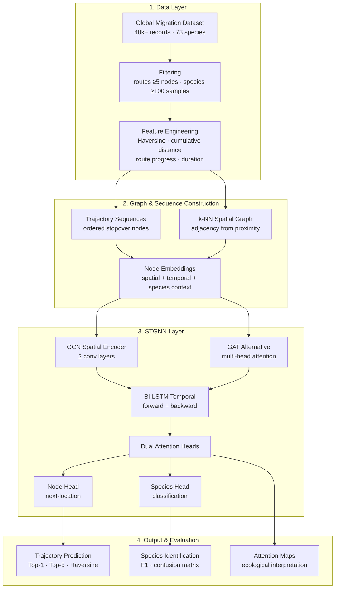

# Spatiotemporal Graph Neural Networks for Migratory Bird Trajectory 
Prediction and Species Identification

**Course:** COMPSCI760 Research Project, University of Auckland, 2025

**Fork of joint work with [Eric Zheng](https://github.com/monoclonalAb).** 
Original repository: https://github.com/monoclonalAb/compsci760

## Overview

This project addresses two linked problems in movement ecology:
1. Predicting future migratory bird trajectories
2. Identifying bird species from movement patterns alone

Using the Global Dataset of Directional Migration Networks, each migratory route  is represented as both a sequence and a k-NN spatial graph with node-level spatiotemporal features. The model couples a GCN-based spatial encoder with a Bi-LSTM temporal module and **dual attention heads** — one specialised for next-node prediction, one for species classification.

The central idea is that migration patterns are species-specific, and trajectory prediction and species identification are inherently interdependent. Most prior work treats them as separate problems.

## Architecture

Each migratory route is represented as an ordered sequence of nodes, where each node combines:
- Spatial features (normalised lat/lon)
- Temporal features (sinusoidal encoding of migration months)
- Derived route metrics (distance to next, cumulative distance, route progress)
- Species context (label-encoded species ID)

Nodes are connected to their k-nearest neighbours in normalised coordinate space, forming the graph structure.

**Model components:**
1. **GCN spatial encoder** — two convolutional layers propagating information across spatially adjacent nodes
2. **Bi-LSTM temporal module** — processes trajectories in both directions
3. **Dual attention heads** — node attention for next-location prediction, species attention for classification
   


**Layer Descriptions**

1. **Data Layer**
The Global Dataset of Directional Migration Networks — 112 species, 1,454 routes. Filtering removed routes with fewer than five GPS nodes and species with fewer than 100 samples, leaving ~40,000 entries across 73 species. Feature engineering computed Haversine distances, cumulative distance, route progress ratio, and estimated duration.

2. **Graph & Sequence Construction**
Each route is represented twice: as an ordered sequence of stopover nodes (for temporal modelling), and as a k-NN spatial graph where nodes connect to geographically proximal neighbours (for relational modelling). Each node embedding combines normalised coordinates, sinusoidal month encoding, derived route metrics, and species label.

3. **STGNN Layer**
GCN or GAT propagates information across the spatial graph. A Bi-LSTM then processes the spatially-encoded sequence in both directions. Dual attention heads — my contribution — split the output: one head learns what matters for next-location prediction, the other learns what discriminates species. Each feeds a separate fully-connected layer with its own loss term.

4. **Output & Evaluation**
Trajectory prediction evaluated by Top-1, Top-5, and Haversine distance. Species classification evaluated by macro-averaged F1 and confusion matrix. Attention weights visualised to identify ecologically meaningful stopover transitions.

## Results

On held-out data (CIFAR-100 equivalent: 40,000+ movement records, 73 species):

| Model | Top-1 | Top-5 | Haversine (km) |
|-------|-------|-------|----------------|
| LightGBM baseline | — | — | 428.89 |
| RNN baseline | — | — | 476.32 |
| STGNN (GAT) | 44.9% | 78.1% | 500.49 |
| **STGNN (GCN)** | **48.6%** | **78.5%** | **331.01** |

- Species identification: **macro-averaged F1 of 0.67** across 73 species
- For species with ≥500 samples, F1 exceeded 0.75
- Dual attention maps highlighted ecologically meaningful transitions — 
  breeding and wintering grounds received high attention weights
- Generalisability analysis across 21 route groupings showed performance scaled 
  with sample density; species accuracy remained robust even under spatial 
  uncertainty


## My Contributions (Gurudas Salunke)

This was a six-person team project. My specific contributions were:

- **Integrated species identification** into the data preprocessing pipeline and the STGNN architecture
- **Designed the dual attention mechanism** — separate attention heads for next-node prediction and species classification, allowing the model to focus on different subspaces of information for each task
- Co-developed the model architecture and experimental design
- **Authored report sections:** Dataset, Dataset Preprocessing, Trajectory Representation, Model Architecture (except Spatial Graph Encoding), Training and Evaluation
- **Authored the Species Identification Performance section**, including the confusion matrix analysis and identification of biologically plausible misclassifications
- **Conducted and wrote the Generalisability Analysis** across 21 migration route groupings, and the Comparison with Related Works

## Full Contributors

| Name | Contribution |
|------|-------------|
| May Gan | Initial STGNN implementation (GCN, BiLSTM, Attention), tuning, evaluation, data visualisation, Related Works |
| **Gurudas Salunke** | Species identification integration, dual attention mechanism, preprocessing, trajectory representation, generalisability analysis, report authorship |
| Maxine Yang | Data preprocessing, haversine evaluation, temporal features, Introduction, Conclusion |
| Yutong Yang | Species identification literature review, Abstract |
| Koutaro Yumiba | Generalisability improvements, visualisations, Methodology, Results |
| Eric Zheng | RNN and LightGBM baselines, GAT integration, Methodology (https://github.com/monoclonalAb)|

## Installation

```
conda create -n cs760 python=3.11.4
conda activate cs760
conda install -c conda-forge -y \
  numpy=1.26.4 \
  pandas=2.2.3 \
  scipy=1.14.1 \
  scikit-learn=1.5.2 \
  joblib=1.2.0 \
  threadpoolctl=3.1.0 \
  openpyxl=3.1.2 \
  matplotlib=3.8.0 \
  nbformat=5.9.2 \
  jupyterlab=4.3.0 \
  lightgbm=4.0.0 \
  optuna==3.6.1 \
  plotly==5.24.1 \
  python-kaleido==0.2.1
conda install -c pytorch -y pytorch torchvision torchaudio cpuonly
```

```
# use python version 3.11.4
# using venv // [venv] is the venv name

python3 -m venv [venv]
source [venv]/bin/activate  # macOS
[venv]\Scripts\activate     # Windows

pip install -r requirements.txt
pip install torch torchvision torchaudio --index-url https://download.pytorch.org/whl/cpu

# run the program
python3 baseline_rnn_birds.py
```

## Repo Structure
```
./data/                                     # contains all the datasets
./src/preprocessing.py                      # initial preprocessing
./preprocessing.py                          # second preprocessing

baseline_hyperparameter_optimization.py     # baseline hyperparamter optimization
baseline_lightgbm_birds.py                  # baseline lightgbm model
baseline_rnn_birds.py                       # baseline rnn model

stgnn.py                                    # stgnn (GCN version)
